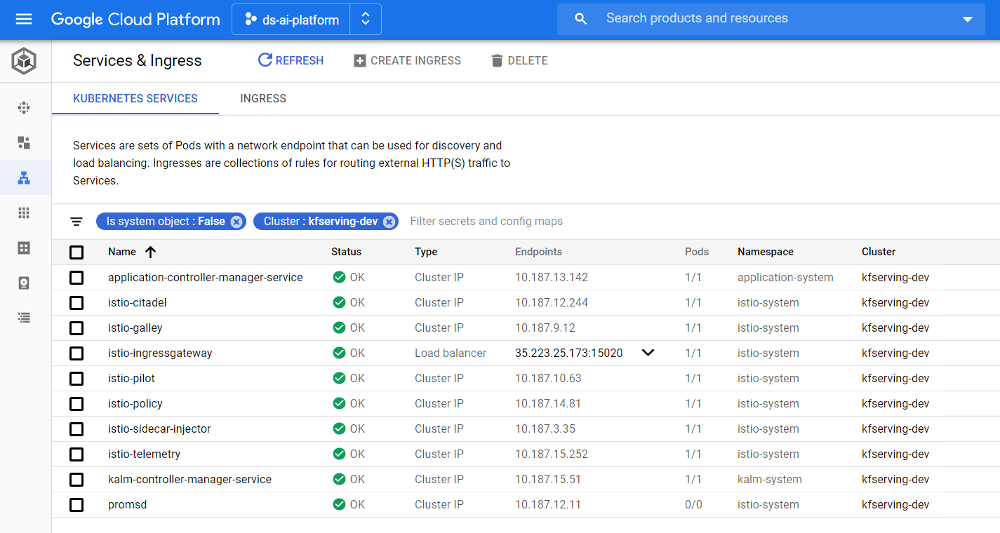
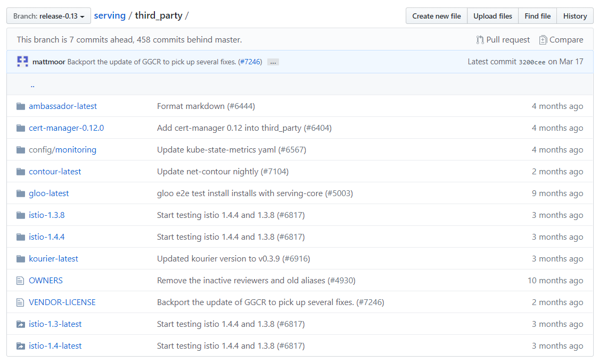
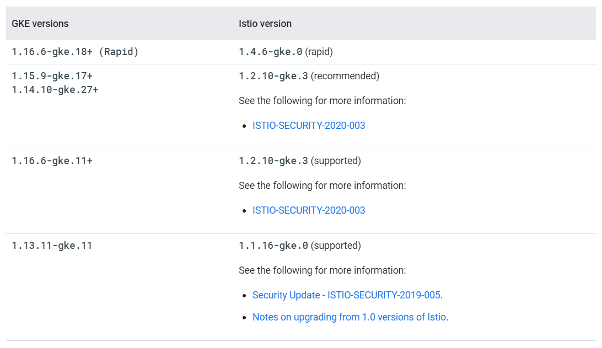
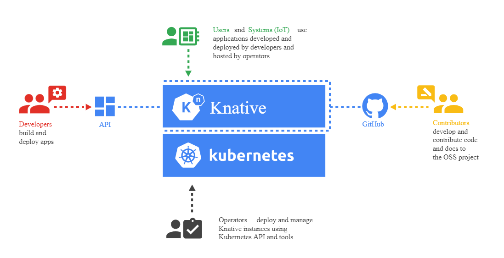

# KFServing

## Installation

`KFServing: v0.3.0`

* Prerequisite:
  * `Istio: v1.1.6+`(`v1.3.1+` for `dex`) -> 1.3.1
  * `Cert Manager: v1.12.0+`
  * `Knative Serving: v0.11.1+`

---

### Install `Istio`

In GKE, we can install `Istio` with Add-ons.
```sh
$ gcloud beta container clusters create \
    ...
    --addons HttpLoadBalancing,Istio,... \
    --istio-config=$ISTIO_CONFIG \
    ...
```
|  |
| ----- |

:warning: But, there is `Third-party` extras in `Knative`. [Read the post.](https://medium.com/google-cloud/how-to-properly-install-knative-on-gke-f39a1274cd4f)
If you need `Knative==0.12` and `Istio==1.3.6`, **You should install those FIRST, with a proper version.**
**Then, the required `Istio` version for `Knative` is differ from `GKE`.**

<https://github.com/knative/serving/tree/master/third_party>
|  |
| ----- |
|  |

### Install `Cert-Manager`

:warning::zap:Requirement: `NAT gateway` for `cert-manager-webhook`

<https://cert-manager.io/docs/installation/kubernetes/>

**Note**: If you are running `Kubernetes v1.15.4 or below`, you will need to add the `--validate=false` flag to your kubectl apply command above else you will receive a validation error relating to the `x-kubernetes-preserve-unknown-fields` field in cert-manager’s `CustomResourceDefinition` resources. This is a benign error and occurs due to the way `kubectl` performs resource validation.

```bash
# cert-manager >= 0.14.3, Kubernetes >= 1.15
curl -sL https://github.com/jetstack/cert-manager/releases/download/v0.14.3/cert-manager.yaml -O && kubectl apply --validate=false -f cert-manager.yaml


# cert-manager < 0.14.3, Kubernetes >= 1.15
$ kubectl create namespace cert-manager
$ curl -sL https://github.com/jetstack/cert-manager/releases/download/v0.12.0/cert-manager.yaml -O && kubectl apply --validate=false -f cert-manager.yaml
$ curl -sL https://raw.githubusercontent.com/knative/serving/release-0.12/third_party/cert-manager-0.12.0/cert-manager-crds.yaml -O && \
    kubectl apply -f cert-manager-crds.yaml && \
    curl -sL https://raw.githubusercontent.com/knative/serving/release-0.12/third_party/cert-manager-0.12.0/cert-manager.yaml -O && \
    kubectl apply -f cert-manager.yaml

# If `Permission Error`: Admin permissions are required to create the necessary RBAC rules 
$ kubectl create clusterrolebinding cluster-admin-binding \
    --clusterrole=cluster-admin \
    --user=$(gcloud config get-value core/account)
```


### Install `Knative`

|  |
| ----- |
Installing cluster-local-gateway for serving cluster-internal traffic
If you installed Istio, you can install a cluster-local-gateway within your Knative cluster so that you can serve cluster-internal traffic. If you want to configure your revisions to use routes that are visible only within your cluster, install and use the cluster-local-gateway

Knative >= v0.13.0
```sh
DIR=knative-v0.13.0
mkdir -p $DIR;cd $DIR

# 1. Install the `CRDs(Custom Resource Definitions)`
curl -sL https://github.com/knative/serving/releases/download/v0.13.0/serving-crds.yaml -O && \
    kubectl apply -f serving-crds.yaml
# 2. Install the core components of `Serving`
curl -sL https://github.com/knative/serving/releases/download/v0.13.0/serving-core.yaml -O && \
    kubectl apply -f serving-core.yaml
# 3-1. Install the Knative Istio controller:
curl -sL https://github.com/knative/serving/releases/download/v0.13.0/serving-istio.yaml -O && \
    kubectl apply -f serving-istio.yaml
# 4. Configure DNS: Magic DNS (`xip.io`)
curl -sL https://github.com/knative/serving/releases/download/v0.13.0/serving-default-domain.yaml -O && \
    kubectl apply -f serving-default-domain.yaml
# 5. Monitor all Knative components are running:
kubectl get pods --namespace knative-serving
# 6. Optional Serving extensions
curl -sL https://github.com/knative/serving/releases/download/v0.13.0/serving-hpa.yaml -O && \
    kubectl apply -f serving-hpa.yaml
curl -sL https://github.com/knative/serving/releases/download/v0.13.0/serving-cert-manager.yaml -O && \
    kubectl apply -f serving-cert-manager.yaml
curl -sL https://github.com/knative/serving/releases/download/v0.13.0/serving-nscert.yaml -O && \
    kubectl apply -f serving-nscert.yaml
# 7. Eventing Components
curl -sL https://github.com/knative/eventing/releases/download/v0.13.0/eventing-crds.yaml -O && \
    kubectl apply -f eventing-crds.yaml
curl -sL https://github.com/knative/eventing/releases/download/v0.13.0/eventing-core.yaml -O && \
    kubectl apply -f eventing-core.yaml
# GCP Pub/Sub Case
curl -sL https://github.com/google/knative-gcp/releases/download/v0.13.0/cloud-run-events.yaml -O && \
    kubectl apply -f cloud-run-events.yaml
curl -sL https://github.com/knative/eventing/releases/download/v0.13.0/channel-broker.yaml -O && \
    kubectl apply -f channel-broker.yaml
# 8. Observability Plugins
curl -sL https://github.com/knative/serving/releases/download/v0.13.0/monitoring-core.yaml -O && \
    kubectl apply -f monitoring-core.yaml
curl -sL https://github.com/knative/serving/releases/download/v0.13.0/monitoring-metrics-prometheus.yaml -O && \
    kubectl apply -f monitoring-metrics-prometheus.yaml

cd ..

# 9. Monitor all Knative components are running:
$ kubectl get pods --namespace knative-serving
$ kubectl get pods --namespace knative-eventing
$ kubectl get pods --namespace knative-monitoring
```

---
## Install KFServing

```sh
# TAG=0.2.2 && \
# wget https://raw.githubusercontent.com/kubeflow/kfserving/master/install/$TAG/kfserving.yaml \
#     -O "kfserving-${TAG}.yaml"
# kubectl apply -f "kfserving-${TAG}.yaml"

TAG=v0.3.0 && \
wget https://raw.githubusercontent.com/kubeflow/kfserving/master/install/$TAG/kfserving.yaml \
    -O "kfserving-${TAG}.yaml"
kubectl apply -f "kfserving-${TAG}.yaml"

# Setting for KFServing pod mutator
# Set Env-var `ENABLE_WEBHOOK_NAMESPACE_SELECTOR` to the Pods have
# `labels: serving.kubeflow.org/inferenceservice: enabled`
## For Kubernetes >= 1.15
kubectl patch \
    mutatingwebhookconfiguration inferenceservice.serving.kubeflow.org \
    --patch '{"webhooks":[{"name": "inferenceservice.kfserving-webhook-server.pod-mutator","objectSelector":{"matchExpressions":[{"key":"serving.kubeflow.org/inferenceservice", "operator": "Exists"}]}}]}'
```

> :no_entry: **Caution with KFServing Standalone**:
>
> KFServing을 독립형으로 설치했을 경우에는 KFServing 컨트롤러는 kfserving-system 네임스페이스에 배포됩니다.
> KFServing은 `pod mutator`와 `mutating admission webhooks` 을 사용하여 KFServing의 스토리지 이니셜라이저(`storage initializer`) 컴포넌트를 주입합니다. 기본적으론 네임스페이스에 `control-plane` 레이블이 지정되어 있지 않으면, 해당 네임스페이스의 포드들은 `pod mutator`를 통과합니다. 그렇기 때문에 KFServing의 `pod mutator`의 `webhook`이 필요 없는 포드가 실행될때 문제가 발생할 수 있습니다.
> 쿠버네티스 1.14 사용자의 경우 `serving.kubeflow.org/inferenceservice: enabled` 레이블이 추가된 네임스페이스의 포드에 `ENABLE_WEBHOOK_NAMESPACE_SELECTOR` 환경변수를 추가하여, `KFServing pod mutator`를 통과하도록 하는게 좋습니다.
>
> **Ref 1**: <https://github.com/kubeflow/kfserving#standalone-kfserving-installation>
> **Ref 2**: <https://www.kangwoo.kr/2020/04/11/kubeflow-kfserving-%EC%84%A4%EC%B9%98>

```yaml
# Fro kube 1.14
env:
- name: ENABLE_WEBHOOK_NAMESPACE_SELECTOR
  value: enabled
```

```sh
# For Kube 1.15
$ kubectl patch \
    mutatingwebhookconfiguration inferenceservice.serving.kubeflow.org \
    --patch '{"webhooks":[{"name": "inferenceservice.kfserving-webhook-server.pod-mutator","objectSelector":{"matchExpressions":[{"key":"serving.kubeflow.org/inferenceservice", "operator": "Exists"}]}}]}'
mutatingwebhookconfiguration.admissionregistration.k8s.io/inferenceservice.serving.kubeflow.org patched
```


---

* KFServing를 서비스하는 Ingress Gateway 확인

```sh
$ kubectl -n knative-serving get cm config-istio \
  -o jsonpath="{.data['gateway\.knative-ingress-gateway']}"
istio-ingressgateway.istio-system.svc.cluster.local
```

:bell::speech_balloon:**Note**: The configuration format should be `gateway.{{gateway_namespace}}.{{gateway_name}}: "{{ingress_name}}.{{ingress_namespace}}.svc.cluster.local"`.
The `{{gateway_namespace}}` is optional.
when it is omitted, the system will search for the gateway in the serving system namespace `knative-serving`.
gateway.knative-serving.knative-ingress-gateway: "istio-ingressgateway.istio-system.svc.cluster.local".

* It can be shown in `ConfigMap` of `InferenceService`. It contains:
  * data
    * ingress: **Ingress** allocation info
    * logger: **Logging Pods** config
    * predictor: **Inference Container Image** info

```sh
$ gateway.knative-serving.knative-ingress-gateway: "istio-ingressgateway.istio-system.svc.cluster.local"

$ kubectl -n kfserving-system get cm inferenceservice-config -o jsonpath="{.data.ingress}"
{
    "ingressGateway" : "knative-ingress-gateway.knative-serving",
    "ingressService" : "istio-ingressgateway.istio-system.svc.cluster.local"
}
```
:warning: **THIS IS _STRING_, YOU CANNOT GET `jsonpath="{.data.ingress.ingressService}"`**, only `"{.data.ingress}"`.  
*`|-` in `YAML`: multi-line string.

~~`kubectl -n kfserving-system get cm inferenceservice-config -o jsonpath="{.data.ingress}"| sed 's/^[{} \t]*//g' | awk '/"ingressService"/ {print}'`~~

---

* Get `Ingress` for `KFServing` info:
```sh
# kubectl -n istio-system get service istio-ingressgateway
$ kubectl -n knative-serving get cm config-istio \
    -o jsonpath="{.data['gateway\.knative-ingress-gateway']}" | cut -d '.' -f1,2 | IFS=. read ING_NM ING_NS && \
    kubectl -n $ING_NS get service $ING_NM

$ kubectl -n kfserving-system get cm inferenceservice-config \
    -o jsonpath="{.data.ingress}"| sed 's/^[{} \t]*//g' | awk -F'"' '/"ingressService"/ {print $4}' | cut -d '.' -f1,2 | IFS=. read ING_NM ING_NS && \
    kubectl -n $ING_NS get service $ING_NM
```

---

## Create an `inferenceservice`

```bash
# kubectl apply -f examples/sklearn/sklearn.yaml
$ curl -fsSL https://raw.githubusercontent.com/kubeflow/kfserving/master/docs/samples/sklearn/sklearn.yaml -O && \
  kubectl apply -f sklearn.yaml

inferenceservice.serving.kubeflow.org/sklearn-iris created
```

####:speech_balloon::bell:KFServing in Kubeflow Installation (from [github/kubeflow](https://github.com/kubeflow/kfserving/blob/master/README.md#kfserving-in-kubeflow-installation))
`KFServing` is installed by default as part of `Kubeflow` installation using `Kubeflow` manifests and `KFServing` controller is deployed in kubeflow namespace.

Since Kubeflow Kubernetes minimal requirement is **`1.14` <font color="red">which does not support `object selector`</font>**, `ENABLE_WEBHOOK_NAMESPACE_SELECTOR` is enabled in Kubeflow installation by default. 

If you are using Kubeflow dashboard or profile controller to create user namespaces, **labels are automatically added to enable KFServing to deploy models.**

If you are creating namespaces manually using Kubernetes apis directly,
<font color="red">you will need to add label **`serving.kubeflow.org/inferenceservice: enabled`**</font> **to allow deploying** `KFServing InferenceService` **in the given namespaces**, and do ensure you do not deploy `InferenceService` in kubeflow namespace which is labelled as `control-panel`.

```sh
kubectl create ns inference-test
kubectl apply -f - <<EOF
apiVersion: "serving.kubeflow.org/v1alpha2"
kind: "InferenceService"
metadata:
  name: "sklearn-iris"
  namespace: "inference-test"
  labels:
    serving.kubeflow.org/inferenceservice: enabled
spec:
  default:
    predictor:
      sklearn:
        storageUri: "gs://kfserving-samples/models/sklearn/iris"
EOF
```

:white_check_mark: **SUCCESS!**
```ascii
namespace/inference-test created
inferenceservice.serving.kubeflow.org/sklearn-iris created
```


> :no_entry: **Error Case:**
> ```ascii
> Error from server (InternalError): error when creating "sklearn.yaml": Internal error occurred: failed calling webhook "inferenceservice.kfserving-webhook-server.defaulter": Post https://kfserving-webhook-server-service.kfserving-system.svc:443/mutate-inferenceservices?timeout=30s: net/http: request canceled while waiting for connection (Client.Timeout exceeded while awaiting headers)
> ```
> 
> :white_check_mark:**Troubleshooting:**
> 
> <https://cloud.google.com/run/docs/gke/troubleshooting#deployment_to_private_cluster_failure_failed_calling_webhook_error>
> 
> ```sh
> $ kubectl get po -n kfserving-system
> NAME                             READY   STATUS    RESTARTS   AGE
> kfserving-controller-manager-0   2/2     Running   1          27m
> 
> 
> # If it is, more often than not, it is caused by a stale webhook, since webhooks are immutable.
> # Even if the KFServing controller is not running,
> # you might have stale webhooks from last deployment causing other issues.
> # Best is to delete them, and test again
> $ kubectl -n kfserving-system \
>       delete mutatingwebhookconfigurations inferenceservice.serving.kubeflow.org && \
>     kubectl delete validatingwebhookconfigurations inferenceservice.serving.kubeflow.org && \
>     kubectl delete po kfserving-controller-manager-0
> mutatingwebhookconfiguration.admissionregistration.k8s.io "inferenceservice.serving.kubeflow.org" deleted
> validatingwebhookconfiguration.admissionregistration.k8s.io "inferenceservice.serving.kubeflow.> org" deleted
> pod "kfserving-controller-manager-0" deleted
> ```

## Get a prediction

```bash
curl -fsSL https://raw.githubusercontent.com/kubeflow/kfserving/master/docs/samples/sklearn/iris-input.json -O

MODEL_NAME=sklearn-iris
INPUT_PATH=@./iris-input.json
CLUSTER_IP=$(kubectl -n istio-system get service istio-ingressgateway -o jsonpath='{.status.loadBalancer.ingress[0].ip}')
SERVICE_HOSTNAME=$(kubectl get inferenceservice sklearn-iris -o jsonpath='{.status.url}' | cut -d "/" -f 3)
echo "$CLUSTER_IP, $SERVICE_HOSTNAME"
curl -v -H "Host: ${SERVICE_HOSTNAME}" http://$CLUSTER_IP/v1/models/$MODEL_NAME:predict -d $INPUT_PATH
curl -v http://$CLUSTER_IP/v1/models/$MODEL_NAME:predict -d $INPUT_PATH
```

```bash
curl -fsSL https://raw.githubusercontent.com/kubeflow/kfserving/master/docs/samples/sklearn/iris-input.json -O

MODEL_NAME=sklearn-iris
INPUT_PATH=@./iris-input.json
CLUSTER_IP=$(kubectl -n istio-system get service istio-ingressgateway -o jsonpath='{.status.loadBalancer.ingress[0].ip}')

CLUSTER_IP=$(kubectl -n istio-system get ing kfserving-ingress -o jsonpath='{.status.loadBalancer.ingress[0].ip}')


SERVICE_HOSTNAME=$(kubectl get inferenceservice sklearn-iris -o jsonpath='{.status.url}' | cut -d "/" -f 3)

curl -v -H "Host: ${SERVICE_HOSTNAME}" http://$CLUSTER_IP/v1/models/$MODEL_NAME:predict -d $INPUT_PATH
```

---

### Volume

```yaml
kind: PersistentVolumeClaim
apiVersion: v1
metadata:
  name: kfserving-models-pvc
spec:
  accessModes:
    - ReadWriteOnce
  resources:
    requests:
      storage: 1Gi
```

---
