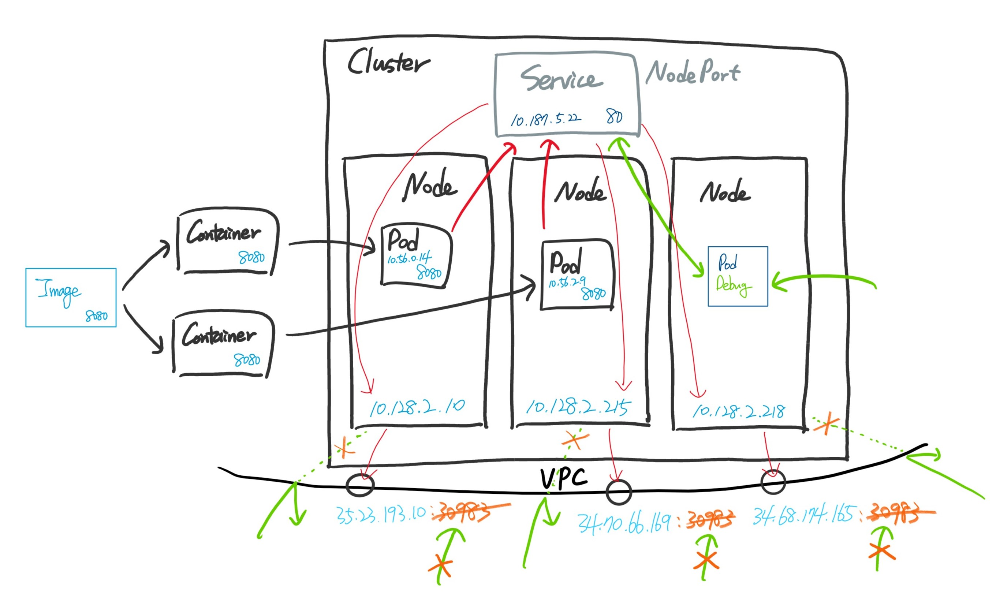

# Exposing

  * [Exposing](exposing/README.md)
    * [**Service**](): An Abstract way to expose APPs, running on a set of Pods.
      * `ClusterIP` type: within Cluster
      * `NodePort` type: rely on Node, if Node(VM) IP is accessible
      * `LoadBalancer` type: by given (IP, DomainName) in Cloud
    * [**Ingress**](): L7 with LoadBalancer

---
## Inside Docker Networking

Default docker network is: `bridge`
```sh
$ nmcli device status
DEVICE           TYPE      STATE         CONNECTION         
docker0          bridge    connected     docker0            
enp0s31f6        ethernet  connected     Wired connection 1 
wlx0013ef601444  wifi      disconnected  --                 
veth647d6fd      ethernet  unmanaged     --                 
veth7a59c27      ethernet  unmanaged     --                 
lo               loopback  unmanaged     --                 
```

Connect a docker to another: `--network` and `--link <NAME>:<ALIAS>`.
```sh
$ docker run --name dbserver --network bridge -e MYSQL_ALLOW_EMPTY_PASSWORD=yes mysql:latest --default-authentication-plugin=mysql_native_password
$ docker run --name webserver --network bridge -p 8080:80 --link dbserver:mdb nginx:latest
```

Show it:
```sh
$ docker ps --format 'table {{.ID}}\t{{.Image}}\t{{.Names}}\t{{.Networks}}\t{{.Ports}}'
CONTAINER ID        IMAGE               NAMES               NETWORKS            PORTS
e22ce14ae3dd        nginx:latest        webserver           bridge              80/tcp
ed360a6f7238        mysql:latest        dbserver            bridge              3306/tcp, 33060/tcp, 0.0.0.0:8080->80/tcp
```

Now `dbserver` can be accessible from `webserver`, using `mdb:3306`.

```sh
docker exec -it webserver /bin/bash
# apt update && apt install default-mysql-client -y
mysql -h mdb -P 3306 -u root
```

---
## Service

<https://cloud.google.com/kubernetes-engine/docs/how-to/exposing-apps>

For test, we use a docker image `gcr.io/google-samples/hello-app:2.0`. Test it locally.
```sh
$ docker run -rm -p 8080:8080 gcr.io/google-samples/hello-app:2.0

# Get the output
$ curl localhost:8080
Hello, world!
Version: 2.0.0
Hostname: efec64468928
```

### Groundwork: Deployment for `sayhello` app

```yaml
kubectl apply -f - <<EOF
apiVersion: apps/v1
kind: Deployment
metadata:
  name: sayhello-deployment
spec:
  replicas: 2
  selector:
    matchLabels:
      app: sayhello
  template:
    metadata:
      name: sayhello-8080server
      labels:
        app: sayhello
    spec:
      containers:
      - name: hello-container
        image: "gcr.io/google-samples/hello-app:2.0"
        ports:
        - containerPort: 8080
EOF
```

```sh
$ kubectl apply -f sayhello-deployment.yaml
deployment.apps/sayhello-deployment created

$ kubectl get pods -o wide
NAME                                  READY   STATUS    RESTARTS   AGE     IP
sayhello-deployment-db9bc6b9f-bqf9t   1/1     Running   0          21s     10.56.0.14
sayhello-deployment-db9bc6b9f-n42tv   1/1     Running   0          21s     10.56.2.9
```

Access it:
```sh
$ kubectl run -i --tty --rm debug1 --image=marketplace.gcr.io/google/ubuntu1804 --restart=Never -- curl 10.56.0.14:8080
Hello, world!
Version: 2.0.0
Hostname: sayhello-deployment-db9bc6b9f-bqf9t
pod "debug1" deleted
$ kkubectl run -i --tty --rm debug2 --image=marketplace.gcr.io/google/ubuntu1804 --restart=Never -- curl 10.56.2.9:8080
Hello, world!
Version: 2.0.0
Hostname: sayhello-deployment-db9bc6b9f-n42tv
pod "debug2" deleted
```

---

### `ClusterIP`: using an app(it can be a set of *Pods*) inside.

|  |
| ----- |

`sayhello-service-clusterip.yaml`:
```yaml
kubectl apply -f - <<EOF
apiVersion: v1
kind: Service
metadata:
  name: sayhello-service-clusterip
spec:
  selector:
    app: sayhello
  ports:
  - name: webport
    protocol: TCP
    # port: Port that Service will be using
    port: 80
    # targetPort: Deployed Container's Port = containerPort
    targetPort: 8080
  type: ClusterIP
EOF
```

```sh
$ kubectl apply -f sayhello-service-clusterip.yaml
service/sayhello-service-clusterip created

$ kubectl get services  # {services, svc}
NAME                         TYPE        CLUSTER-IP     EXTERNAL-IP   PORT(S)   AGE
kubernetes                   ClusterIP   10.187.0.1     <none>        443/TCP   13h
sayhello-service-clusterip   ClusterIP   10.187.6.190   <none>        80/TCP    2m15s
```

Access it, using `CLUSTER-IP=10.187.6.190` and Service `NAME`:
```sh
# CLUSTER-IP=10.187.6.190
$ kubectl run -i --tty --rm debug1 \
    --image=marketplace.gcr.io/google/ubuntu1804 \
    --restart=Never -- \
    curl 10.187.6.190:80
Hello, world!
Version: 2.0.0
Hostname: sayhello-deployment-db9bc6b9f-n42tv
pod "debug1" deleted

# Service Name
$ kubectl run -i --tty --rm debug2 \
    --image=marketplace.gcr.io/google/ubuntu1804 \
    --restart=Never -- \
    curl sayhello-service-clusterip:80
Hello, world!
Version: 2.0.0
Hostname: sayhello-deployment-db9bc6b9f-bqf9t
pod "debug2" deleted
```

In case Service's Label Selector(`spec.selector`) and Pod's Label(`metadata.labels`) are matched,  
Kubernetes creates an Endpoint that has the same name as your Service.
```sh
$ kubectl get endpoints  # {endpoints, ep}
NAME                         ENDPOINTS                        AGE
kubernetes                   172.31.1.34:443                  15h
sayhello-service-clusterip   10.56.0.14:8080,10.56.2.9:8080   163m
```

---

### `NodePort`: using an app(it can be a set of *Pods*) through *Nodes*.

|  |
| ----- |

`sayhello-service-nodeport.yaml`:
```yaml
kubectl apply -f - <<EOF
apiVersion: v1
kind: Service
metadata:
  name: sayhello-service-nodeport
spec:
  selector:
    app: sayhello
  ports:
  - name: webport
    protocol: TCP
    # port: Port that Service will be using
    port: 80
    # targetPort: Deployed Container's Port = containerPort
    targetPort: 8080
  ################ ClusterIP -> NodePort
  type: NodePort
EOF
```

```sh
$ kubectl apply -f sayhello-service-nodeport.yaml
service/sayhello-service-nodeport created

$ kubectl get svc
NAME                         TYPE        CLUSTER-IP     EXTERNAL-IP   PORT(S)        AGE
kubernetes                   ClusterIP   10.187.0.1     <none>        443/TCP        16h
sayhello-service-clusterip   ClusterIP   10.187.6.190   <none>        80/TCP         178m
sayhello-service-nodeport    NodePort    10.187.5.22    <none>        80:30983/TCP   82s

# 80   : Port on Service, not Pod's(container).
# 30983: Port on Node's (all VMs having Pods).
```

Access it, with `CLUSTER-IP` and *Nodes* `(INTERNAL-IP, EXTERNAL-IP)`(if not a private cluster).

1. `CLUSTER-IP`, as `ClusterIP` Services:
```sh
$ kubectl get svc
NAME                         TYPE        CLUSTER-IP     EXTERNAL-IP   PORT(S)        AGE
kubernetes                   ClusterIP   10.187.0.1     <none>        443/TCP        16h
sayhello-service-clusterip   ClusterIP   10.187.6.190   <none>        80/TCP         178m
sayhello-service-nodeport    NodePort    10.187.5.22    <none>        80:30983/TCP   82s
```

```sh
# CLUSTER-IP=10.187.5.22
$ kubectl run -i --tty --rm debug1 --image=marketplace.gcr.io/google/ubuntu1804 --restart=Never -- curl 10.187.5.22:80
Hello, world!
Version: 2.0.0
Hostname: sayhello-deployment-db9bc6b9f-bqf9t
pod "debug1" deleted

# Service Name
$ kubectl run -i --tty --rm debug2 --image=marketplace.gcr.io/google/ubuntu1804 --restart=Never -- curl sayhello-service-nodeport:80
Hello, world!
Version: 2.0.0
Hostname: sayhello-deployment-db9bc6b9f-bqf9t
pod "debug2" deleted
```

2. `(INTERNAL-IP, EXTERNAL-IP)`, as VM:

```sh
$ kubectl get nodes -o wide
NAME                                           STATUS   ROLES    AGE   INTERNAL-IP    EXTERNAL-IP
gke-kfserving-dev-default-pool-08499930-wwz8   Ready    <none>   16h   10.128.2.215   34.70.66.169
gke-kfserving-dev-default-pool-3477a340-fl90   Ready    <none>   16h   10.128.2.218   34.68.174.165
gke-kfserving-dev-default-pool-5ca12738-qbhk   Ready    <none>   16h   10.128.2.10    35.23.193.10
```

2-1. At this time, we can `curl` directly because `EXTERNAL-IP` is opened.
```sh
# 30983, NOT 80
$ curl 34.70.66.169:30983

$ curl 34.68.174.165:30983

$ curl 35.23.193.10:30983
```

2-2. At the same time, we can `curl` inside the `vpc` or the private network the cluster Node exists.
***`INTERNAL-IP` is the private IP of the Node(VM)**, not the IP inside the cluster(it's `CLUSTER-IP`).
```sh
$ curl 10.128.2.215:30983

$ curl 10.128.2.218:30983

$ curl 10.128.2.10:30983
```

:warning: **Most clusters shoud have <font style="color:red "><b>private IP</b></font> and <font style="color:red"><b>firewall</b></font>** options. so  
* **2-1** is impossible because it have only <font style="color:red "><b>private IPs</b></font>. ~~`EXTERNAL-IP`~~
* **2-2** should not be allowed with <font style="color:red "><b>Firewall on port</b></font> ~~`30983`~~.

so we need to have an exposed Endpoint allowed to external access.  
There is a two options:
  * Direct way: Each Service has **HTTP/s Endpoint** of Cloud Provider, by using `LoadBalancer(HTTP or TCP/UDP)` type.
  * Indirect way: Use `Ingress` object to manage All incoming requests together, as unified.

---

### `LoadBalancer`: allowed way to access `NodePort`

|  |
| ----- |

`sayhello-service-loadbalancer.yaml`:
```yaml
kubectl apply -f - <<EOF
apiVersion: v1
kind: Service
metadata:
  name: sayhello-service-loadbalancer
spec:
  selector:
    app: sayhello
  ports:
  - name: webport
    protocol: TCP
    # port: Port that Service will be using
    port: 80
    # targetPort: Deployed Container's Port = containerPort
    targetPort: 8080
  ################ NodePort -> LoadBalancer
  type: LoadBalancer
EOF
```

```sh
$ kubectl apply -f sayhello-service-loadbalancer.yaml
service/sayhello-service-loadbalancer created

########## <pending>: Work-in-progress, HTTP/s LoadBalancer is creating...
$ kubectl get svc
NAME                            TYPE           CLUSTER-IP     EXTERNAL-IP   PORT(S)        AGE
kubernetes                      ClusterIP      10.187.0.1     <none>        443/TCP        17h
sayhello-service-clusterip      ClusterIP      10.187.6.190   <none>        80/TCP         4h10m
sayhello-service-loadbalancer   LoadBalancer   10.187.12.31   <pending>     80:32146/TCP   19s
sayhello-service-nodeport       NodePort       10.187.5.22    <none>        80:30983/TCP   73m


########## SUCCESS!
$ kubectl get svc
NAME                            TYPE           CLUSTER-IP     EXTERNAL-IP     PORT(S)        AGE
kubernetes                      ClusterIP      10.187.0.1     <none>          443/TCP        17h
sayhello-service-clusterip      ClusterIP      10.187.6.190   <none>          80/TCP         4h11m
sayhello-service-loadbalancer   LoadBalancer   10.187.12.31   35.223.25.173   80:32146/TCP   109s
sayhello-service-nodeport       NodePort       10.187.5.22    <none>          80:30983/TCP   74m

# 35.223.25.173: Assigned and allowed EXTERNAL-IP, "HTTP/s" with 80, 8080, and 443 only.
# <https://cloud.google.com/load-balancing/docs/https#open_ports>

# 80   : Port on Service, opened.
# 32146: Port on Node's (all VMs having Pods), load-balanced.
```

Access it, **ANYWHERE**:
```sh
$ curl 35.223.25.173:80
Hello, world!
Version: 2.0.0
Hostname: sayhello-deployment-db9bc6b9f-n42tv
```
---

### (Optional) Network LoadBalancer(TCP/UDP LoadBalancer)

`sayhello-service-networkloadbalancer.yaml`:
```yaml
kubectl apply -f - <<EOF
apiVersion: v1
kind: Service
metadata:
  name: sayhello-service-networkloadbalancer
spec:
  selector:
    app: sayhello
  ports:
  - name: webport
    protocol: TCP
    ################ custom port, not in (80, 8080, 443)
    port: 63214
    # targetPort: Deployed Container's Port = containerPort
    targetPort: 8080
  # LoadBalancer
  type: LoadBalancer
EOF
```

```sh
$ kubectl apply -f sayhello-service-networkloadbalancer.yaml
service/sayhello-service-networkloadbalancer created

$ kubectl get svc
NAME                                   TYPE           CLUSTER-IP     EXTERNAL-IP     PORT(S)           AGE
kubernetes                             ClusterIP      10.187.0.1     <none>          443/TCP           17h
sayhello-service-clusterip             ClusterIP      10.187.6.190   <none>          80/TCP            4h26m
sayhello-service-loadbalancer          LoadBalancer   10.187.12.31   35.223.25.173   80:32146/TCP      16m
sayhello-service-networkloadbalancer   LoadBalancer   10.187.3.20    35.184.44.79    63214:32078/TCP   57s
sayhello-service-nodeport              NodePort       10.187.5.22    <none>          80:30983/TCP      89m
```

Access it, **ANYWHERE**:
```sh
$ curl 35.184.44.79:63214
Hello, world!
Version: 2.0.0
Hostname: sayhello-deployment-db9bc6b9f-bqf9t
```

List the `forwarding-rules`, and you can find LoadBalancer`s IPs.
```sh
$ gcloud compute forwarding-rules list
$ gcloud compute forwarding-rules list| grep '35.184.44.79\|35.223.25.173'
NAME                REGION       IP_ADDRESS      IP_PROTOCOL  TARGET
b35ea881cff         us-central1  35.223.25.173   TCP          us-central1/targetPools/a191dc88
8b4c1b84cd5         us-central1  35.184.44.79    TCP          us-central1/targetPools/a9c76274

# gcloud compute url-maps list
```

### use `kubectl expose`:

```sh
DEPLOY_YAML="sayhello-service-loadbalancer.yaml"
$ kubectl expose -f DEPLOY_YAML
```

```sh
DEPLOY_NAME="sayhello-service-loadbalancer"
SERVICE_TYPE="LoadBalancer"
PROTOCOL="TCP"  # TCP|UDP|SCTP
SERVICE_PORT="63214"
TARGET_PORT="8080"

$ kubectl expose deployment \
    $DEPLOY_YAML \
    --name $DEPLOY_NAME \
    --type $SERVICE_TYPE \
    --protocol TCP
    --port $SERVICE_PORT \
    --target-port $TARGET_PORT
    #--external-ip
```

---

### `ExternalName`: A Forwarding Service to call from `OUTSIDE`

`sayhello-service-externalname.yaml`:
```yaml
kubectl apply -f - <<EOF
apiVersion: v1
kind: Service
metadata:
  name: sayhello-service-externalname
spec:
  selector:
    app: sayhello
  ports:
  - name: mysql-userdb
    protocol: TCP
    port: 33060
    targetPort: 3306
  # LoadBalancer -> ExternalName
  type: ExternalName
  externalName: mysql-userdb.pydemia.org
EOF
```

```sh
$ kubectl apply -f sayhello-service-externalname.yaml
service/sayhello-service-externalname created

$ kubectl get svc
NAME                                   TYPE           CLUSTER-IP      EXTERNAL-IP                PORT(S)           AGE
kubernetes                             ClusterIP      10.187.0.1      <none>                     443/TCP           41h
sayhello-service-clusterip             ClusterIP      10.187.6.190    <none>                     80/TCP            28h
sayhello-service-externalname          ExternalName   <none>          mysql-userdb.pydemia.org   33060/TCP         23h
sayhello-service-loadbalancer          LoadBalancer   10.187.12.31    35.223.25.173              80:32146/TCP      24h
sayhello-service-networkloadbalancer   LoadBalancer   10.187.3.20     35.184.44.79               63214:32078/TCP   24h
sayhello-service-nodeport              NodePort       10.187.5.22     <none>                     80:30983/TCP      25h

# EXTERNAL-IP: mysql-userdb.pydemia.org
# PORT: 33060
```
:white_check_mark: **Now `Pods` can call external addresses from cluster inside,** without NAT. 
**`ExternalName` is for `Pods` to request to outside**, not requests from cluster outside.  
(Pods cannot access external services by default.)


:bell:**Note**: `ExternalName` accepts an IPv4 address string, but as a DNS names comprised of digits, not as an IP address. `ExternalNames` that resemble IPv4 addresses are not resolved by `CoreDNS` or `ingress-nginx` because `ExternalName` is intended to specify a canonical DNS name. To hardcode an IP address, consider using `headless Services`.

---
### `Ingress`: an unified URL Endpoint for Multiple Backend Services

Not multiple Endpoints, use `Ingress` to manage.

|  |
| ----- |

  * Ingress for External LoadBalancing
  * Ingress for Internal LoadBalancing


#### Container-native LoadBalancing: A direct way to expose Pod Endpoints using NEGs(Network Endpoint Groups)

> [**NEG(Network Endpoint Group)**](https://cloud.google.com/load-balancing/docs/negs)
> NEGs define how a set of endpoints should be reached, whether they are reachable, and where they are located.
> 
> A **zonal NEG** contains one or more endpoints that can be Compute Engine VMs or services running on the VMs. Each endpoint is specified as an `IP:port` combination.
> 
> An **internet NEG** contains a single endpoint that is hosted outside of Google Cloud. This endpoint is specified by hostname `FQDN:port` or `IP:port`.


`sayhello-service-for-ingress.yaml`:
```yaml
kubectl apply -f - <<EOF
apiVersion: v1
kind: Service
metadata:
  name: sayhello-service-for-ingress
spec:
  selector:
    app: sayhello
  ports:
  - name: webport
    protocol: TCP
    # port: Port that Service will be using
    port: 80
    # targetPort: Deployed Container's Port = containerPort
    targetPort: 8080
  ################ NodePort
  type: NodePort
EOF
```

```sh
$ kubectl apply -f sayhello-service-for-ingress.yaml
service/sayhello-service-for-ingress created

$ kubectl get svc
NAME                                   TYPE           CLUSTER-IP      EXTERNAL-IP                PORT(S)           AGE
kubernetes                             ClusterIP      10.187.0.1      <none>                     443/TCP           41h
sayhello-service-clusterip             ClusterIP      10.187.6.190    <none>                     80/TCP            28h
sayhello-service-externalname          ExternalName   <none>          mysql-userdb.pydemia.org   33060/TCP         23h
sayhello-service-for-ingress           NodePort       10.187.10.172   <none>                     80:32740/TCP      10h
sayhello-service-loadbalancer          LoadBalancer   10.187.12.31    35.223.25.173              80:32146/TCP      24h
sayhello-service-networkloadbalancer   LoadBalancer   10.187.3.20     35.184.44.79               63214:32078/TCP   24h
sayhello-service-nodeport              NodePort       10.187.5.22     <none>                     80:30983/TCP      25h
```

Then, Create an DIRECT `Ingress` Resource:

`sayhello-ingress.yaml`:
```yaml
kubectl apply -f - <<EOF
apiVersion: networking.k8s.io/v1beta1
# Ingress
kind: Ingress
metadata:
  name: sayhello-ingress
spec:
  backend:
    ################ ServiceName: DIRECT WAY 
    serviceName: sayhello-service-for-ingress
    servicePort: 80
EOF
```

```sh
$ kubectl apply -f sayhello-ingress.yaml
ingress.networking.k8s.io/sayhello-ingress created

$ kubectl get ingress  # {ingress, ing}
NAME               HOSTS   ADDRESS   PORTS   AGE
sayhello-ingress   *                 80      13s

########## CASE 1. EMPTY ADDRESS: work-in-progress, LoadBalancer is creating...
$ kubectl describe ingress sayhello-ingress
Name:             sayhello-ingress
Namespace:        default
Address:          34.102.186.32
Default backend:  sayhello-service-for-ingress:80 (10.56.0.14:8080,10.56.2.9:8080)
Rules:
  Host        Path  Backends
  ----        ----  --------
  *           *     sayhello-service-for-ingress:80 (10.56.0.14:8080,10.56.2.9:8080)
Annotations:  ingress.kubernetes.io/backends: {"k8s-be-32740--c9350a459bee8250":"Unknown"}
              ingress.kubernetes.io/forwarding-rule: k8s-fw-default-sayhello-ingress--c9350a459bee8250
              ingress.kubernetes.io/target-proxy: k8s-tp-default-sayhello-ingress--c9350a459bee8250
              ingress.kubernetes.io/url-map: k8s-um-default-sayhello-ingress--c9350a459bee8250
Events:
  Type    Reason  Age   From                     Message
  ----    ------  ----  ----                     -------
  Normal  ADD     83s   loadbalancer-controller  default/sayhello-ingress
  Normal  CREATE  33s   loadbalancer-controller  ip: 34.102.186.32

##########
########## CASE 2. BACKEND UNKNOWN State :
##########         Unknown until the backend service receives traffic...
##########         readinessProbe and HealthCheck(for service) can help!
$ kubectl describe ingress sayhello-ingress
Name:             sayhello-ingress
Namespace:        default
Address:          34.102.186.32
Default backend:  sayhello-service-for-ingress:80 (10.56.0.14:8080,10.56.2.9:8080)
Rules:
  Host        Path  Backends
  ----        ----  --------
  *           *     sayhello-service-for-ingress:80 (10.56.0.14:8080,10.56.2.9:8080)
Annotations:  ingress.kubernetes.io/backends: {"k8s-be-32740--c9350a459bee8250":"Unknown"}
              ingress.kubernetes.io/forwarding-rule: k8s-fw-default-sayhello-ingress--c9350a459bee8250
              ingress.kubernetes.io/target-proxy: k8s-tp-default-sayhello-ingress--c9350a459bee8250
              ingress.kubernetes.io/url-map: k8s-um-default-sayhello-ingress--c9350a459bee8250
Events:
  Type    Reason  Age    From                     Message
  ----    ------  ----   ----                     -------
  Normal  ADD     3m57s  loadbalancer-controller  default/sayhello-ingress
  Normal  CREATE  3m7s   loadbalancer-controller  ip: 34.102.186.32


########## SUCCESS! (~ about 8mins)
$ kubectl describe ingress sayhello-ingress
Name:             sayhello-ingress
Namespace:        default
Address:          34.102.186.32
Default backend:  sayhello-service-for-ingress:80 (10.56.0.14:8080,10.56.2.9:8080)
Rules:
  Host        Path  Backends
  ----        ----  --------
  *           *     sayhello-service-for-ingress:80 (10.56.0.14:8080,10.56.2.9:8080)
Annotations:  ingress.kubernetes.io/backends: {"k8s-be-32740--c9350a459bee8250":"HEALTHY"}
              ingress.kubernetes.io/forwarding-rule: k8s-fw-default-sayhello-ingress--c9350a459bee8250
              ingress.kubernetes.io/target-proxy: k8s-tp-default-sayhello-ingress--c9350a459bee8250
              ingress.kubernetes.io/url-map: k8s-um-default-sayhello-ingress--c9350a459bee8250
Events:
  Type    Reason  Age    From                     Message
  ----    ------  ----   ----                     -------
  Normal  ADD     7m55s  loadbalancer-controller  default/sayhello-ingress
  Normal  CREATE  7m5s   loadbalancer-controller  ip: 34.102.186.32

$ kubectl get ing
NAME               HOSTS   ADDRESS         PORTS   AGE
sayhello-ingress   *       34.102.186.32   80      8m42s
```

Access it, **ANYWHERE**:
```sh
$ curl 34.102.186.32:80
Hello, world!
Version: 2.0.0
Hostname: sayhello-deployment-db9bc6b9f-n42tv
```

#### (Optional) Assign A Static IP to `Ingress`

```yaml
kubectl apply -f - <<EOF
apiVersion: networking.k8s.io/v1beta1
# Ingress
kind: Ingress
metadata:
  name: sayhello-ingress
  ###############################################################
  annotations:
    kubernetes.io/ingress.global-static-ip-name: "xx.xxx.x.xxx"
spec:
  backend:
    ################ ServiceName: DIRECT WAY 
    serviceName: sayhello-service-for-ingress
    servicePort: 80
EOF
```

#### Serve Multiple Apps on ONE LoadBalancer

`sayhello-ingress-multiservice-with-multipath..yaml`:
```yaml
kubectl apply -f - <<EOF
apiVersion: networking.k8s.io/v1beta1
# Ingress
kind: Ingress
metadata:
  name: sayhello-ingress
  annotations:
    #### If `ingress.class` is not given, default ingress-controller of cloud service will be assigned.(In this case, GKE or Istio)
    # kubernetees.io/ingress.class: "nginx"
spec:
  rules:
  # Under `rules`, Multiple `host`s can be defined.
  # host: somehost
  - http:
      paths:
        ################ ServiceName: INDIRECT WAY, using PATH `/sayhello-nodeport/`
      - path: /sayhello-nodeport/*
        backend:
          serviceName: sayhello-service-nodeport
          servicePort: 80
        ################ ServiceName: INDIRECT WAY, using PATH `/sayhello-service-for-ingress/`
      - path: /v2/*
        backend:
          serviceName: sayhello-service-for-ingress
          servicePort: 80
EOF
```

```sh
$ kubectl apply -f sayhello-ingress-multiservice-with-multipath.yaml
ingress.networking.k8s.io/sayhello-ingress configured

########## BACKEND UNKNOWN State: 
##########         Unknown until the backend service receives traffic...
##########         readinessProbe and HealthCheck(for service) can help!
$ kubectl describe ing sayhello-ingress
Name:             sayhello-ingress
Namespace:        default
Address:          34.102.186.32
Default backend:  default-http-backend:80 (10.56.1.20:8080)
Rules:
  Host        Path  Backends
  ----        ----  --------
  *           
              /sayhello-nodeport/*   sayhello-service-nodeport:80 (10.56.0.14:8080,10.56.2.9:8080)
              /v2/*                  sayhello-service-for-ingress:80 (10.56.0.14:8080,10.56.2.9:8080)
Annotations:  ingress.kubernetes.io/backends:
                {"k8s-be-30983--c9350a459bee8250":"Unknown","k8s-be-31878--c9350a459bee8250":"Unknown","k8s-be-32740--c9350a459bee8250":"HEALTHY"}
              ingress.kubernetes.io/forwarding-rule: k8s-fw-default-sayhello-ingress--c9350a459bee8250
              ingress.kubernetes.io/target-proxy: k8s-tp-default-sayhello-ingress--c9350a459bee8250
              ingress.kubernetes.io/url-map: k8s-um-default-sayhello-ingress--c9350a459bee8250
Events:       <none>

########## SUCCESS!
$ kubectl describe ing sayhello-ingress
Name:             sayhello-ingress
Namespace:        default
Address:          34.102.186.32
Default backend:  default-http-backend:80 (10.56.1.20:8080)
Rules:
  Host        Path  Backends
  ----        ----  --------
  *           
              /sayhello-nodeport/*   sayhello-service-nodeport:80 (10.56.0.14:8080,10.56.2.9:8080)
              /v2/*                  sayhello-service-for-ingress:80 (10.56.0.14:8080,10.56.2.9:8080)
Annotations:  ingress.kubernetes.io/backends:
                {"k8s-be-30983--c9350a459bee8250":"HEALTHY","k8s-be-31878--c9350a459bee8250":"HEALTHY","k8s-be-32740--c9350a459bee8250":"HEALTHY"}
              ingress.kubernetes.io/forwarding-rule: k8s-fw-default-sayhello-ingress--c9350a459bee8250
              ingress.kubernetes.io/target-proxy: k8s-tp-default-sayhello-ingress--c9350a459bee8250
              ingress.kubernetes.io/url-map: k8s-um-default-sayhello-ingress--c9350a459bee8250
Events:       <none>


$ curl 34.102.186.32/sayhello-nodeport/
Hello, world!
Version: 2.0.0
Hostname: sayhello-deployment-db9bc6b9f-n42tv

$ curl 34.102.186.32/sayhello-for-ingress/
Hello, world!
Version: 2.0.0
Hostname: sayhello-deployment-db9bc6b9f-bqf9t
```

---
#### Health Check with `readinessProbe`(or `livenessProbe`)

:warning: By default, `Ingress` performs **a periodic health check** by making a `GET` request on the `/` path to determine health of the application, and expects *HTTP 200 response*. If you want to check a different path or to expect a different response code, you can use **a custom health check path**.

##### Option 1. Apply `readinessProbe` to Pods.

```yaml
kubectl apply -f - <<EOF
apiVersion: apps/v1
kind: Deployment
metadata:
  name: sayhello-deployment
spec:
  replicas: 2
  selector:
    matchLabels:
      app: sayhello
  template:
    metadata:
      name: sayhello-8080server
      labels:
        app: sayhello
    spec:
      containers:
      - name: hello-container
        image: "gcr.io/google-samples/hello-app:2.0"
        ports:
        - name: readiness-port
          containerPort: 8080
        readinessProbe:
          httpGet:
            path: /healthy
            port: readiness-port
            # httpHeaders:
            # - name: Custom-Header
            #   value: Awesome
          initialDelaySeconds: 20
          periodSeconds: 10
          failureThreshold: 30
EOF
```

:bell:**Note**: If the Deployment is **configured or scaled to `0` Pods**, the HTTP readiness probe's path is set to `/`, **regardless of the value of `readinessProbe.path`.**
<br>


##### Option 2. (In `Istio`) Use [`Istio VirtualService`](https://istio.io/docs/concepts/traffic-management/#virtual-services), `readinessProbe` to Pods.

Prerequisite: `Istio`

<https://istio.io/docs/ops/configuration/mesh/app-health-check/>

###### 2-1. `readinessProbe` with Command

```sh
$ kubectl create ns "istio-healthcheck"
namespace/istio-healthcheck created
```

```yaml
kubectl apply -f - <<EOF
apiVersion: "authentication.istio.io/v1alpha1"
kind: "Policy"
metadata:
  name: "default"
  namespace: "istio-healthcheck"
spec:
  peers:
  - mtls: {}

---
apiVersion: "networking.istio.io/v1alpha3"
kind: "DestinationRule"
metadata:
  name: "default"
  namespace: "istio-healthcheck"
spec:
  host: "*.default.svc.cluster.local"
  # trafficPolicy:
  #   tls:
  #     mode: ISTIO_MUTUAL
EOF
```

<br>

###### 2-2. `readinessProbe` with HTTP request

1. Set `Istio` with `values.sidecarInjectorWebhook.rewriteAppHTTPProbe=true`
2. Annotate to `Pods`: `annotations: sidecar.istio.io/rewriteAppHTTPProbers: "true"`


* Set `Istio`:
  * Install `Istio` with `--set values.sidecarInjectorWebhook.rewriteAppHTTPProbe=true` or
  * Re-configure with the following:
```sh
$ kubectl get cm istio-sidecar-injector -n istio-system -o yaml | sed -e 's/"rewriteAppHTTPProbe": false/"rewriteAppHTTPProbe": true/' | kubectl apply -f -
```

Or, you can re-deploy to **ANNOTATE** to Pods with `sidecar.istio.io/rewriteAppHTTPProbers: "true"`

```yaml
kubectl apply -f - <<EOF
apiVersion: apps/v1
kind: Deployment
metadata:
  name: sayhello-deployment
spec:
  replicas: 2
  selector:
    matchLabels:
      app: sayhello
  template:
    metadata:
      #################### Annotated
      annotations:
        sidecar.istio.io/rewriteAppHTTPProbers: "true"
      name: sayhello-8080server
      labels:
        app: sayhello
    spec:
      containers:
      - name: hello-container
        image: "gcr.io/google-samples/hello-app:2.0"
        ports:
        - name: readiness-port
          containerPort: 8080
        readinessProbe:
          httpGet:
            path: /healthy
            port: readiness-port
            # httpHeaders:
            # - name: Custom-Header
            #   value: Awesome
          initialDelaySeconds: 20
          periodSeconds: 10
          failureThreshold: 30
EOF
```
